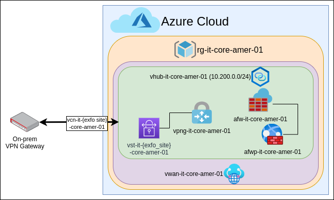

# Azure Hub Module

  
<p align="center">
  
</p>

Hub module to create the hub portion of a hub and spoke architecture.
The module will create the following resources:

- resource group
- vWAN
- Secured virtual hub (includes firewall)
- Firewall policy
- Virtual Network gateway
- VPN sites
- VPN gateway connections

The module supports BGP if desired but will use static routes if no BGP parameters are defined.

### Sample Usage

```hcl
module "vwan" {
  source = "../modules/mesh"

  business_unit = "it"
  env           = "core"
  location      = "Canada Central"
  region_code   = "cac-01"
  address_space = "192.168.100.0/24"

  bgp_settings = {
    bgp_settings = {
      link0 = "169.254.21.1"
      link1 = "169.254.21.5"
    }
  }

  vpn_connections = {
    gcp = {
      address_cidrs = ["192.168.0.0/18"]
      shared_key    = "Password"
      vpn_links = {
        link1 = {
          peer_ip = "35.35.35.35"
          bgp = {
            bgp = {
              asn         = "64514"
              bgp_peer_ip = "169.254.21.2"
            }
          }
        },
        link2 = {
          peer_ip = 96.96.96.96
          bgp = {
            bgp = {
              asn         = "64514"
              bgp_peer_ip = "169.254.21.6"
            }
          }
        }
      }
    }
  }

  application_rule_collection = {
    allow-internal-web = {
      priority = 1000
      action   = "Allow"
      rules = {
        allow-http = {
          protocols         = { Http = 80, Https = 443 }
          source_addresses  = ["192.168.0.0/16", "10.0.0.0/8"]
          destination_fqdns = ["*"]
        }
      }
    }
  }
  network_rule_collection     = {
    allow-internal-ssh = {
      priority = 500
      action   = "Allow"
      rules = {
        allow-ssh = {
          protocols             = ["TCP"]
          source_addresses      = ["192.168.0.0/16", "10.0.0.0/8"]
          destination_addresses = ["192.168.0.0/18"]
          destination_ports     = ["22"]
        }
      }
    }
  }

  global_tags = {
    costCenter  = "it"
    contact     = "555-876-5309"
  }
}
```

### Inputs

#### Required Inputs

| Name | Description | Type |
|------|-------------|------|
| location | Azure region where resources are being created | string |
| region\_code | Three to four letter code designation for the azure region | string |
| business\_unit | Business unit that owns these resources. Used in names and in tags | string |
| address\_space | Address space used by the hub virtual network. Must be at least /24 | string |

#### Optional Inputs

| Name | Description | Type | Default |
|------|-------------|------|---------|
| env | Environment of the deployment | string | core |
| global\_tags | global tags assigned to all resources in the module | map(any) | {} |
| bgp\_settings | Block to enable BGP and define the BGP endpoints on the gateway. If undefined, BGP will be disabled. | <pre>map(object({<br>  link0 = string<br>  link1 = string<br>}))</pre> | {} |
| vpn\_connections | Definition of the different VPN connections. Each block within contains the definition of a single VPN site with connections. NOTE If bgp is not enabled, address_cidrs must be defined. | <pre>map(object({<br>  shared_key = string<br>  address_cidrs = optional(list(string))<br>  vpn\_links = map(object({<br>    peer\_ip = string<br>    bgp = optional(map(object({<br>      asn = string<br>      bgp\_peer\_ip = string<br>    })))<br>  }))<br>}))</pre> | {} |
| application\_rule\_collection | each block defines an application rule to add to the firewall policy | <pre>map(object({<br>  priority = number<br>  action = string<br>  rules = map(object({<br>    source\_addresses = optional(list(any))<br>    source\_ip\_groups = optional(list(any))<br>    destination_urls = optional(list(any))<br>    destination\_fqdns = optional(list(any))<br>    destination\_fqdn\_tags = optional(list(any))<br>    terminate\_tls = optional(bool)<br>    web\_categories = <br>    protocols = map(any)<br>  }))<br>}))</pre> | {} |
| network\_rule\_collection | Each block defines a network rule to add to the firewall policy | <pre>map(object({<br>  priority = number<br>  action = string<br>  rule = map(object({<br>    protocols = list(string)<br>    source_addresses = optional(list(string))<br>    source_ip_groups = optional(list(string))<br>    destination_addresses = optional(list(string))<br>    destination_ip_groups = optional(list(string))<br>    destination_fqdns = optional(list(string))<br>    destination_ports = optional(list(string))<br>  }))<br>}))</pre> | {} |
| nat\_rule\_collection | Each block defines a NAT rule to add to the firewall policy | <pre>map(object({<br>  priority = number<br>  action = string<br>  rule = map(object({<br>    protocols = list(string)<br>    source_addresses = optional(list(string))<br>    source_ip_groups = optional(list(string))<br>    destination_address = optional(list(string))<br>    destination_ports = optional(list(string))<br>    translated_address = optional(string)<br>    translated_fqdn = optional(string)<br>    translated_port = string<br>  }))<br>}))</pre> | {} |
